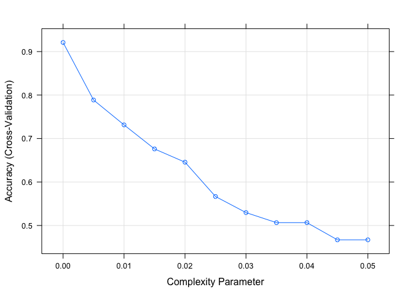
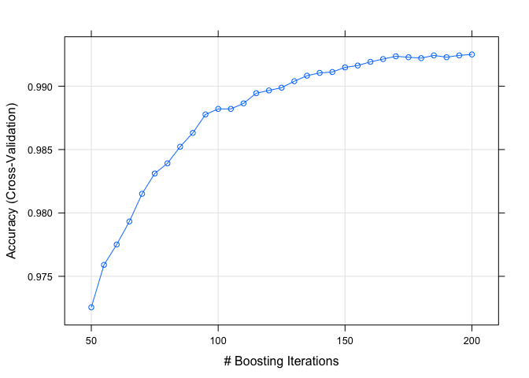
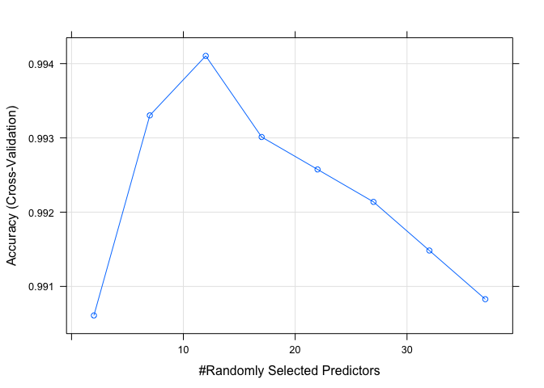
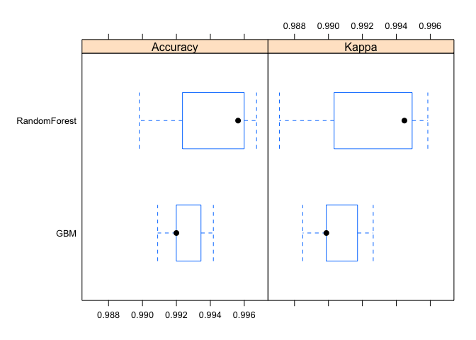

Summary
-------

With the use of devices such as Jawbone Up, Nike FuelBand, and Fitbit it is now possible to collect a large amount of data about personal activity. These devices are part of the quantified self movement – people who take measurements about themselves regularly to improve their health and/or to find patterns in their behavior. One thing that people regularly do is quantify how much of a particular activity they do, but they rarely quantify how well they do it. The goal of this project is to use data from accelerometers on the belt, forearm, arm, and dumbell of 6 participants to predict how well they do the excercises. They were asked to perform barbell lifts correctly and incorrectly in 5 different ways.

More information about this data is available from the website here: <http://groupware.les.inf.puc-rio.br/har> (section on the Weight Lifting Exercise Dataset). The data for this project also come from this site.

Data Preprocessing
------------------

``` r
trainUrl <- "https://d396qusza40orc.cloudfront.net/predmachlearn/pml-training.csv"
testUrl  <- "https://d396qusza40orc.cloudfront.net/predmachlearn/pml-testing.csv"
trainFile <- "pml-training.csv"
testFile  <- "pml-testing.csv"

if (!file.exists(trainFile)) {
  download.file(trainUrl, destfile=trainFile, method="curl")
}
if (!file.exists(testFile)) {
  download.file(testUrl, destfile=testFile, method="curl")
}

training <- read.csv(file = trainFile, header = TRUE, sep = ",")
testing  <- read.csv(file = testFile, header = TRUE, sep = ",")

dim(training); dim(testing)
```

    ## [1] 19622   160

    ## [1]  20 160

The training file contains 19622 observations of 160 variables, while the test file has 20 observations of 160 variables. Closer look at training data reveals that there are a lot of NA values in a number of columns. We check now how many rows in each column are affected, to see if it's better to remove observations, or the variables.

``` r
training_na <- training[, colSums(is.na(training)) != 0]
na_count <-sapply(training_na, function(na) sum(is.na(na)))
na_count <- data.frame(na_count)
```

The 67 columns that have NA values contain almost only NA values (this check is not shown here). In each case 19216 observations (98% of the training sample) are NA, therefore these variables will be deleted. Additionally, first 7 colums of data are not useful for predictions, they will be removed as well. Out of remaining variables there are still a few which are empty, they will also be removed. This leaves the training sample with 53 predictors.

``` r
trainingData <- training[, colSums(is.na(training)) == 0]#removing variables with NA
trainingData <- trainingData[ ,-c(1:7)]#removing irrelevant/empty variables
classe <- trainingData$classe
trainingData <- trainingData[, sapply(trainingData, is.numeric)]
trainingData$classe <- classe

testingData <- testing[, colSums(is.na(testing)) == 0]
testingData <- testingData[ ,-c(1:7)]
testingData <- testingData[, sapply(testingData, is.numeric)]

dim(trainingData); dim(testingData)
```

    ## [1] 19622    53

    ## [1] 20 53

The training set will be divided now into train and validation samples, to help model selection.

``` r
inTrain <- createDataPartition(y = trainingData$classe, p = 0.7, list = FALSE)
trainSub <- trainingData[inTrain,]
validSub <- trainingData[-inTrain,]
```

Prediction model evaluation
---------------------------

We consider here classification trees (`rpart`), random forests (`rf`), and boosted regression (`gbm`) models. The cross validation is done by `cv` method in the trainControl, for which 5-fold method was chosen.

#### Classification trees (rpart)

``` r
set.seed(123)
trCtrl <- trainControl(method = 'cv', number = 5, summaryFunction = defaultSummary)
grid_rpart <- expand.grid(cp = seq(0, 0.05, 0.005))#complexity parameter
fit_rpart <- train(classe~., data = trainSub, method = 'rpart', trControl = trCtrl,tuneGrid = grid_rpart)
```

    ## Loading required package: rpart

``` r
print(fit_rpart)
```

    ## CART 
    ## 
    ## 13737 samples
    ##    52 predictor
    ##     5 classes: 'A', 'B', 'C', 'D', 'E' 
    ## 
    ## No pre-processing
    ## Resampling: Cross-Validated (5 fold) 
    ## Summary of sample sizes: 10990, 10989, 10990, 10989, 10990 
    ## Resampling results across tuning parameters:
    ## 
    ##   cp     Accuracy   Kappa    
    ##   0.000  0.9212341  0.9004137
    ##   0.005  0.7966806  0.7427087
    ##   0.010  0.7178429  0.6408286
    ##   0.015  0.6630996  0.5754334
    ##   0.020  0.6431541  0.5517305
    ##   0.025  0.5423311  0.4034452
    ##   0.030  0.5423311  0.4034452
    ##   0.035  0.5090634  0.3587984
    ##   0.040  0.4895550  0.3329552
    ##   0.045  0.4895550  0.3329552
    ##   0.050  0.4677937  0.2954246
    ## 
    ## Accuracy was used to select the optimal model using  the largest value.
    ## The final value used for the model was cp = 0.

``` r
plot(fit_rpart)
```



``` r
###
folds = createFolds(trainSub$classe, k = 5)
error = rep(0, 5)
for (k in 1:5) {
    test = trainSub[unlist(folds[k]), ]
    pred = predict(fit_rpart, test)
    accuracy = sum(as.numeric(pred) == as.numeric(test$classe)) / length(pred)
    error_k = 1 - accuracy
    error[k] = error_k
}
error_rpart = round(mean(error)*100, digits = 2)
```

The out of sample error estimations for classification tree is **4.09%**. This is the weakest model of all considered.

#### Boosted regression (gbm)

``` r
set.seed(456)
trCtrl <- trainControl(method = 'cv', number = 5, summaryFunction = defaultSummary)
grid_gbm <- expand.grid( n.trees = seq(50, 200, 5), interaction.depth = c(10), shrinkage = c(0.1), n.minobsinnode = 20)
fit_gbm <- train(classe~., data = trainSub, method = 'gbm', trControl = trCtrl, tuneGrid = grid_gbm, verbose = FALSE)
print(fit_gbm)
```

    ## Stochastic Gradient Boosting 
    ## 
    ## 13737 samples
    ##    52 predictor
    ##     5 classes: 'A', 'B', 'C', 'D', 'E' 
    ## 
    ## No pre-processing
    ## Resampling: Cross-Validated (5 fold) 
    ## Summary of sample sizes: 10988, 10991, 10990, 10989, 10990 
    ## Resampling results across tuning parameters:
    ## 
    ##   n.trees  Accuracy   Kappa    
    ##    50      0.9707364  0.9629777
    ##    55      0.9724829  0.9651892
    ##    60      0.9746667  0.9679539
    ##    65      0.9782341  0.9724664
    ##    70      0.9796899  0.9743072
    ##    75      0.9814370  0.9765193
    ##    80      0.9831113  0.9786368
    ##    85      0.9844214  0.9802944
    ##    90      0.9857317  0.9819525
    ##    95      0.9863869  0.9827816
    ##   100      0.9870422  0.9836100
    ##   105      0.9879886  0.9848073
    ##   110      0.9888622  0.9859123
    ##   115      0.9889349  0.9860040
    ##   120      0.9898085  0.9871090
    ##   125      0.9902452  0.9876616
    ##   130      0.9905363  0.9880296
    ##   135      0.9906819  0.9882140
    ##   140      0.9908276  0.9883981
    ##   145      0.9910460  0.9886743
    ##   150      0.9913372  0.9890426
    ##   155      0.9914101  0.9891350
    ##   160      0.9915557  0.9893191
    ##   165      0.9918468  0.9896873
    ##   170      0.9917740  0.9895952
    ##   175      0.9921381  0.9900559
    ##   180      0.9922108  0.9901480
    ##   185      0.9922109  0.9901478
    ##   190      0.9922836  0.9902400
    ##   195      0.9925748  0.9906082
    ##   200      0.9925021  0.9905164
    ## 
    ## Tuning parameter 'interaction.depth' was held constant at a value of
    ##  10
    ## Tuning parameter 'shrinkage' was held constant at a value of
    ##  0.1
    ## Tuning parameter 'n.minobsinnode' was held constant at a value of 20
    ## Accuracy was used to select the optimal model using  the largest value.
    ## The final values used for the model were n.trees = 195,
    ##  interaction.depth = 10, shrinkage = 0.1 and n.minobsinnode = 20.

``` r
plot(fit_gbm)
```



``` r
###
folds = createFolds(trainSub$classe, k = 5)
error = rep(0, 5)
for (k in 1:5) {
    test = trainSub[unlist(folds[k]), ]
    pred = predict(fit_gbm, test)
    accuracy = sum(as.numeric(pred) == as.numeric(test$classe)) / length(pred)
    error_k = 1 - accuracy
    error[k] = error_k
}
error_gbm = round(mean(error)*100, digits = 7)
```

The out of sample error estimations for boosted regression is **0%**. This model has much higher accuracy with a very small (near zero) error .

#### Random forests (rf)

``` r
set.seed(789)
trCtl <- trainControl(method = 'cv', number = 5, summaryFunction = defaultSummary)
grid_rf <- expand.grid( mtry = seq(2, 40, 5))
fit_rf <- train(classe~., data = trainSub, method = 'rf', trControl = trCtl, tuneGrid = grid_rf, verbose = FALSE)
print(fit_rf)
```

    ## Random Forest 
    ## 
    ## 13737 samples
    ##    52 predictor
    ##     5 classes: 'A', 'B', 'C', 'D', 'E' 
    ## 
    ## No pre-processing
    ## Resampling: Cross-Validated (5 fold) 
    ## Summary of sample sizes: 10989, 10991, 10989, 10989, 10990 
    ## Resampling results across tuning parameters:
    ## 
    ##   mtry  Accuracy   Kappa    
    ##    2    0.9893716  0.9865555
    ##    7    0.9926475  0.9906994
    ##   12    0.9930844  0.9912516
    ##   17    0.9924292  0.9904229
    ##   22    0.9919922  0.9898703
    ##   27    0.9911916  0.9888574
    ##   32    0.9903910  0.9878443
    ##   37    0.9893717  0.9865550
    ## 
    ## Accuracy was used to select the optimal model using  the largest value.
    ## The final value used for the model was mtry = 12.

``` r
plot(fit_rf)
```



``` r
###
folds = createFolds(trainSub$classe, k = 5)
error = rep(0, 5)
for (k in 1:5) {
    test = trainSub[unlist(folds[k]), ]
    pred = predict(fit_rf, test)
    accuracy = sum(as.numeric(pred) == as.numeric(test$classe)) / length(pred)
    error_k = 1 - accuracy
    error[k] = error_k
}
error_rf = round(mean(error)*100, digits = 7)
```

The out of sample error estimations for random forests is **0%**. This model also has high accuracy and low (near zero) error. Let's compare boosted regression and random forests models, as they both perform better than classification tree (rpart).

``` r
results <- resamples(list(GBM = fit_gbm, RandomForest = fit_rf))

# summarize the distributions
summary(results)
```

    ## 
    ## Call:
    ## summary.resamples(object = results)
    ## 
    ## Models: GBM, RandomForest 
    ## Number of resamples: 5 
    ## 
    ## Accuracy 
    ##                Min. 1st Qu. Median   Mean 3rd Qu.   Max. NA's
    ## GBM          0.9920  0.9920 0.9924 0.9926  0.9927 0.9938    0
    ## RandomForest 0.9916  0.9927 0.9931 0.9931  0.9934 0.9945    0
    ## 
    ## Kappa 
    ##                Min. 1st Qu. Median   Mean 3rd Qu.   Max. NA's
    ## GBM          0.9899  0.9899 0.9903 0.9906  0.9908 0.9922    0
    ## RandomForest 0.9894  0.9908 0.9913 0.9913  0.9917 0.9931    0

``` r
bwplot(results)
```



Model choice and prediction
---------------------------

Model comparison suggests that among checked models, boosted regression perform as well as random forests, with very slight differences. The random forests model was chosen as the final model.

One can check the model accuracy on full (not folded) trainSub sample and check out of sample error on the validSub sample:

``` r
set.seed(333)
grid <- expand.grid(fit_rf$bestTune)
model <- train(classe~., data = trainSub, method = 'rf', tuneGrid = grid, verbose = FALSE)

prediction <- predict(model, validSub)
error = 1- sum(as.numeric(prediction) == as.numeric(validSub$classe)) / length(prediction)
```

The training model accuracy is **99.71%** and the out of sample error on validSub data set for this model is **0.29%**

Test sample prediction
----------------------

The final test sample prediction gives the following results:

``` r
set.seed(3234)
final_prediction <- predict(model, testingData)
final_prediction
```

    ##  [1] B A B A A E D B A A B C B A E E A B B B
    ## Levels: A B C D E
